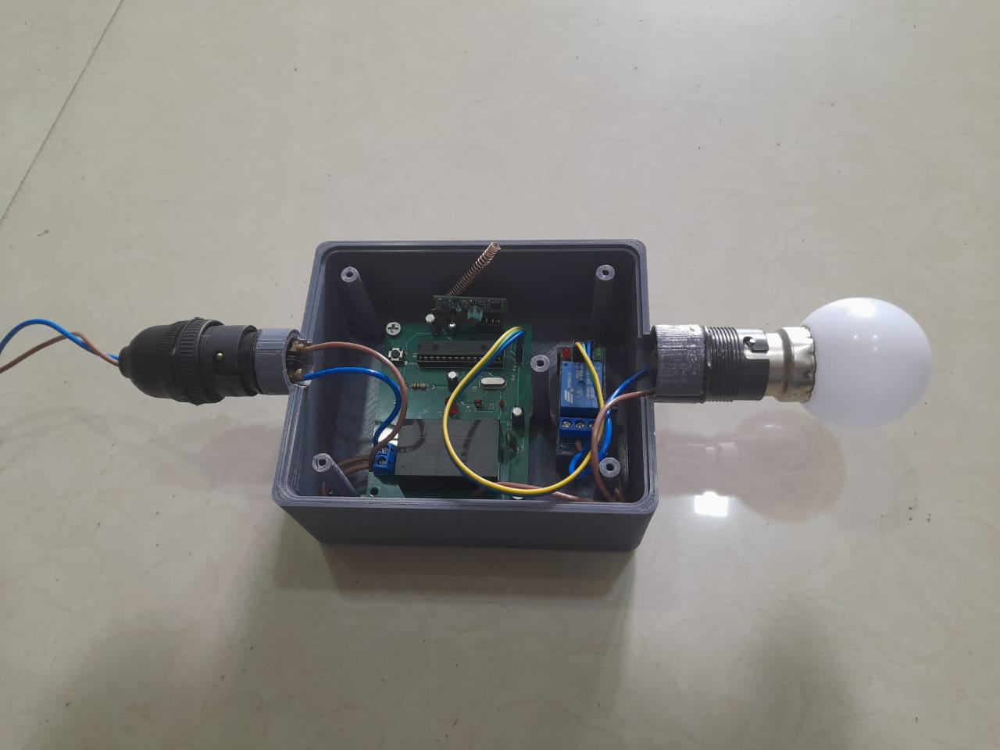

# Power Saving Automatic Light Controller

## Project Overview
The Power Saving Automatic Light Controller is designed to automatically control lighting to conserve energy. This system uses motion detection to operate lights only when necessary, thus enhancing efficiency and reducing electricity consumption.

## Team Members
- **Sahan Dissanayaka**
- **Sadaru Liyanaarachchi**
- **Pasindu Nimsara**
- **Dilshan Nuwantha**

## Contents
1. [Specifications](#specifications)
2. [Circuit Design](#circuit-design)
3. [Enclosure Design](#enclosure-design)
4. [Budget Proposal](#budget-proposal)
5. [Finalized Product](#finalized-product)
6. [Contributions](#contributions)

## Specifications
### Transmitter Part

- Controlled by ATMEGA328PU micro-controller
- Motion detection using two ultrasonic sensors
- Communication with receiver using 433 MHz transmitter
- Wi-Fi updates via ESP8266 module
- Powered by two 3.7V rechargeable batteries

### Receiver Part

- Controlled by ATMEGA328PU micro-controller
- Communication with transmitter using 433 MHz receiver
- Power supply: 230V AC to 5V DC step-down transformer

## Circuit Design
### Transmitter Side
- Ultrasonic sensors for motion detection
- 433 MHz transmitter for wireless communication
- ESP8266 wifi module for Wi-Fi connectivity

### Receiver Side
- 433 MHz receiver for wireless communication
- Step-down transformer for power supply

## Enclosure Design
### Transmitter Enclosure
- Designed for portability and durability
- Protects internal components from environmental factors

### Receiver Enclosure
- Designed for fixed installation
- Ensures safety and longevity of internal components

## Finalized Product
- **Transmitter Part**: Efficiently detects motion and transmits data wirelessly.
- **Receiver Part**: Receives data and controls lighting based on the received information.

## Thank You
Thank you for reviewing our project. We appreciate your interest and support.
